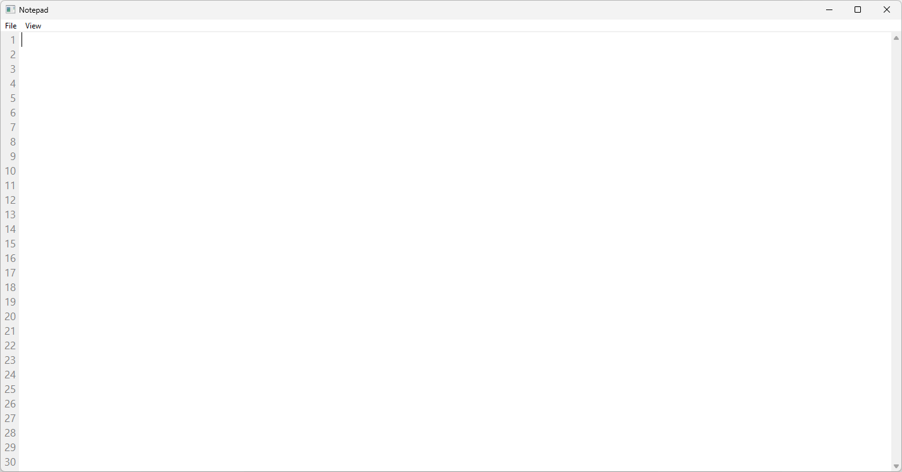
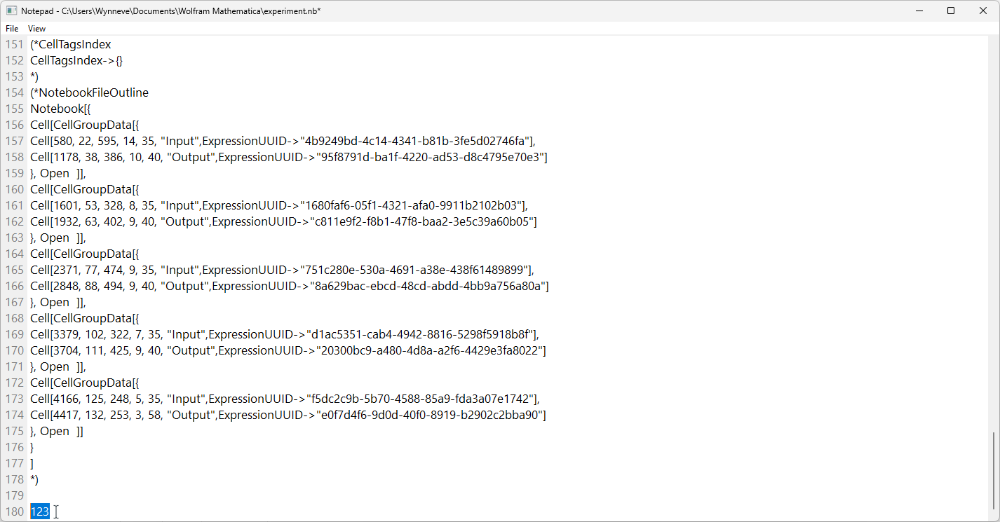
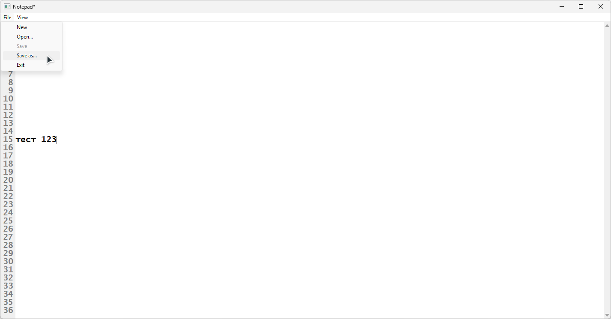
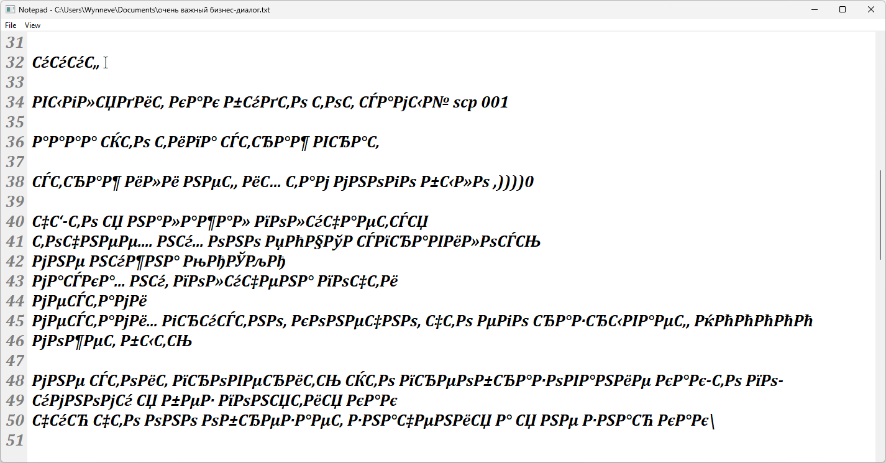

# Блокнот на ассемблере

Это блокнот, написанный на языке 64-битного варианта Microsoft Assembler (MASM64) под ОС Windows. Этот проект был написан мной в результате первой попытки создать графическое приложение на ассемблере.

## Возможности

Этот блокнот позволяет редактировать текст и работать с файлами с помощью графического интерфейса.

Поддерживаются:
* создание, чтение и запись файлов
* настройка внешнего вида (шрифт текста)
* адаптивность (изменение размеров окна)
* отображение номеров строк

## Ограничения

Во-первых, очевидно, отсутствует кроссплатформенность, причём даже «хуже», чем в случае с консольным приложением.

Во-вторых, для упрощения реализации, имеется только поддержка ASCII и включённого в системе его расширения, т.е. установленной кодовой страницы.

В-третьих, программа лишена интерактивных диалогов: проверки на сохранение перед созданием нового документа или закрытием программы и соответствующих сообщений нет.

## Устройство

Графический интерфейс включает в себя следующие элементы:

1. **Меню**, имеющее следующую структуру:
  ∙ **Файл**:
  ∙ ∙ **Новый** (создать новый документ)
  ∙ ∙ **Открыть...** (прочитать документ из файла)
  ∙ ∙ **Сохранить** (сохранить документ в новый или открытый файл)
  ∙ ∙ **Сохранить как...** (сохранить документ в указанный файл)
  ∙ ∙ **Выход** (закрыть программу)
  ∙ **Вид**:
  ∙ ∙ **Шрифт...** (настроить шрифт текста)

2. **Левый столбец**, отображающий номера строк

3. **Текстовое поле**, содержащее редактируемый текст.

## Планы

### Код
- [ ] Задействовать больше ассемблерных инструкций вместо примитивных конструкций (например, инструкции для манипуляции строками)
- [ ] Оптимизировать использование регистров, сейчас они иногда задействуются неприлично расточительно
- [ ] Выделить роли и названия для регистров в рамках функций с помощью констант, вместо сырого именования и опоры на комментарии
- [ ] Упорядочить список констант, сейчас всё свалено в кучу

### Текст
- [ ] Разобраться в конфигурации контрола текстового поля, возможно, получится его осовременить
- [ ] Переписать логику работы с текстом и заменить функции, добившись поддержки Юникода

### Интерфейс
- [ ] Добавить строку состояния, где будет отображена позиция каретки
- [ ] Добавить локализацию

### Поведение
- [ ] Проверять состояние документа: при закрытии программы или создании нового документа предлагать сохранить его в случае присутствующих изменений
- [ ] Сделать так, чтобы параметры шрифта сохранялись при перезаходе в диалог его настройки

### Оформление
- [ ] Добавить ресурсы: в частности, иконку приложения

## Сборка

Требуется наличие Microsoft Visual Studio Build Tools. После установки компонента для нативной разработки нужно запустить `x64 Native Tools Command Prompt` и перейти в корень репозитория, после чего надо исполнить скрипт `build.cmd`. В результате появится исполняемый файл `app.exe`.

## Скриншоты

|||
|-|-|
|||
